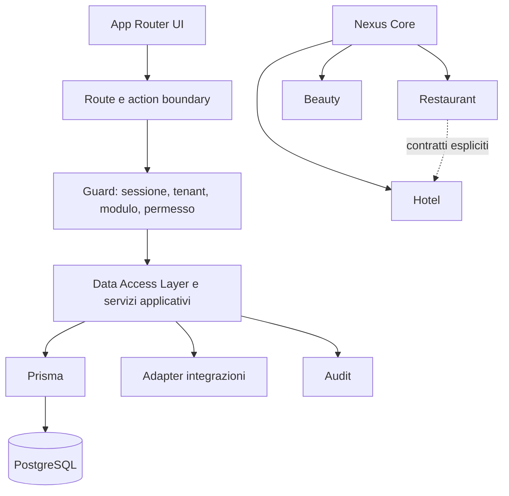
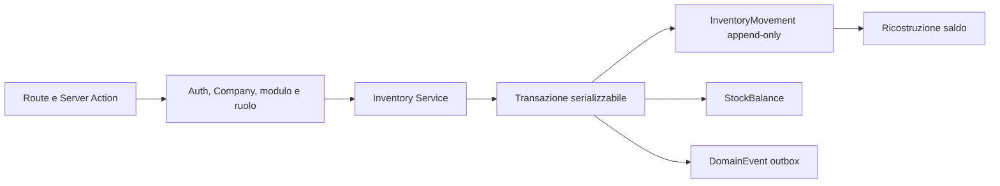
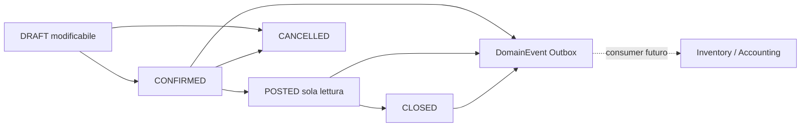
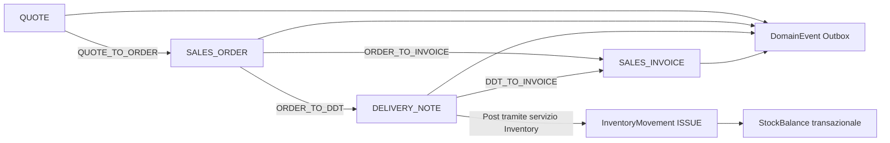
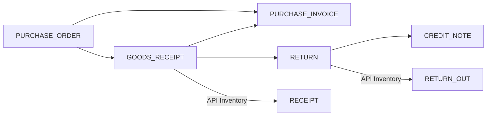
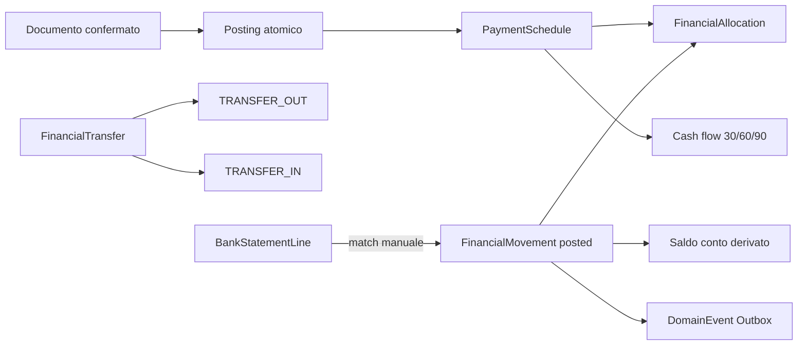
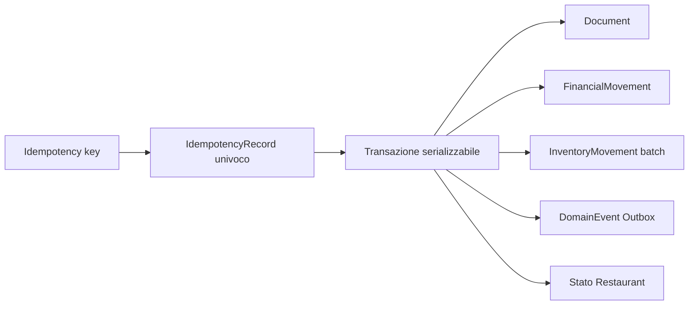

# Architettura di Nexus ERP

## Restaurant Engine MVP

Restaurant è un application layer sopra gli Engine Core. Prenotazione, sala, menu, comanda e cucina appartengono al verticale; Partner, Item/Recipe, giacenze, documenti e movimenti finanziari restano dei rispettivi engine. Il flusso è `Reservation → Order → KitchenTicket → served/Inventory consumption → BusinessDocument Sales → Treasury receipt`. Gli eventi sono persistiti in `DomainEvent`; nessun worker Outbox è incluso. Il realtime cucina usa refresh/polling semplice.

## Stato e obiettivo

Nexus ERP è un'applicazione web TypeScript basata su Next.js 16 App Router, React 19, Auth.js, Prisma 7 e PostgreSQL. Lo schema attuale contiene identità, Company, Membership, ruoli, Partner, catalogo Item, Configuration Engine, sedi, Inventory Engine, Unified Document Engine, Sales Engine, Purchasing Engine e Treasury Engine, oltre all'attivazione moduli per Company. Gran parte dei verticali descritti qui resta architettura target.

`prisma/schema.prisma` resta il riferimento eseguibile; `docs/database/schema.dbml` ne documenta la struttura relazionale corrente.

## Vista logica



## Runtime Next.js

### App Router e componenti

Le route vivono in `app/`. I route group organizzano autenticazione e dashboard senza modificare l'URL. I componenti sono **Server Components** per default; si introduce `"use client"` solo ai confini interattivi che richiedono stato, eventi o API browser. Dati sensibili e accesso Prisma restano server-only.

Le pagine e i layout compongono la UI, ma un controllo nel layout è solo difesa aggiuntiva: non sostituisce l'autorizzazione di query, Server Action o Route Handler.

### Server Actions e Route Handlers

Le Server Actions sono endpoint pubblicamente raggiungibili e devono essere trattate come mutation boundary. Ogni action:

1. valida input e dimensioni;
2. verifica la sessione;
3. risolve Membership e Company attiva sul server;
4. verifica modulo e permesso;
5. applica tenant scope alla lettura che prova ownership;
6. esegue la mutazione, preferibilmente in transazione;
7. registra audit ed eventuale outbox;
8. invalida solo cache o route necessarie;
9. restituisce un DTO minimo senza dettagli interni.

I Route Handlers seguono le stesse regole e sono preferiti per API, webhook e protocolli esterni. Nessun identificativo `companyId` ricevuto dal client determina il tenant.

## Identità, tenancy e autorizzazione

### Auth.js e Membership

Auth.js gestisce autenticazione e sessioni. `User` rappresenta l'identità globale; `Membership` rappresenta l'appartenenza a una Company. Un utente può avere più Membership, ma ogni richiesta opera in una sola Company attiva e in una Membership attiva.

L'azienda attiva deve essere risolta da sessione server-side e verificata sul database. Il cambio azienda rigenera o aggiorna in sicurezza il contesto e invalida dati dipendenti.

### Ruoli e permessi

I ruoli sono insiemi di permessi assegnati alla Membership. L'autorizzazione effettiva è l'intersezione di:

```text
sessione valida
∩ Membership attiva
∩ Company attiva
∩ modulo attivo
∩ feature flag compatibile
∩ permesso richiesto
∩ eventuale scope di sede
```

I permessi sono positivi ed espliciti. Un ruolo non attraversa automaticamente le aziende e la disattivazione di un modulo rende inefficaci i suoi permessi.

### Tenant scope obbligatorio

Ogni entità aziendale possiede direttamente `companyId` oppure ha un percorso relazionale non ambiguo verso una Company. Per entità operative ad alto rischio si preferisce `companyId` diretto anche quando ridondante, con vincoli e transazioni che ne preservino la coerenza.

Regole per ogni query e mutation:

- derivare `companyId` dal contesto verificato;
- includerlo nel filtro iniziale, non filtrare in memoria;
- usare `findFirst`/filtri composti quando l'identificativo globale non incorpora il tenant;
- verificare che relazioni in input appartengano alla stessa Company;
- non usare operazioni Prisma non scoped nei domini tenant;
- restituire “non trovato” quando opportuno, senza rivelare esistenza cross-tenant;
- testare casi con due Company e identificativi validi ma appartenenti all'altra.

Una futura policy PostgreSQL Row-Level Security può aggiungere difesa in profondità, ma non sostituisce queste regole.

### Multi-sede

`Location` è figlia di Company e ha codice tenant-unique, lifecycle soft-delete, dati operativi e una sola headquarters attiva garantita dal servizio transazionale. La sede corrente V1 è `Membership.defaultLocationId`, validata server-side contro Company, stato attivo e soft delete; non deriva da URL o stato client. Lo scope Location restringe il tenant, non lo rimpiazza. Questo foundation non filtra ancora gli Engine operativi: Warehouse, Inventory, Documents, Treasury, Restaurant, Beauty e Hotel adotteranno lo scoping nello sprint successivo.

## Moduli e feature flag

Le definizioni modulo sono globali e versionate nel codice/configurazione; l'attivazione è salvata per Company. Un `ModuleRegistry` futuro espone codice stabile, categoria, dipendenze, route, permessi e capacità. Il resolver centrale calcola lo stato effettivo e impedisce configurazioni invalide.

Il registry distingue Nexus Core, sempre attivo, dai bundle commerciali Restaurant, Beauty e Hotel e dai moduli acquistabili singolarmente. Più bundle possono convivere nella stessa Company. L'attivazione di un bundle applica la configurazione predefinita del [catalogo](MODULE_CATALOG.md#bundle-commerciali-e-configurazioni-predefinite), poi risolve dipendenze e personalizzazioni ammesse.

I feature flag gestiscono rollout o varianti all'interno di un modulo; non sostituiscono attivazione né autorizzazione. Devono avere owner, ambiente, scadenza e fallback sicuro.

La protezione opera a più livelli:

- navigazione filtrata per evitare funzioni irrilevanti;
- page/layout guard per accesso diretto;
- guard in ogni Server Action e Route Handler;
- scheduler e consumer che controllano il modulo prima di eseguire;
- report e ricerca limitati ai moduli attivi.

Vedere [Dipendenze fra moduli](MODULE_DEPENDENCIES.md).

## Convenzione futura dei moduli

Una struttura indicativa, da adottare quando inizierà l'implementazione:

```text
modules/
  core/
  restaurant/
    reservations/
      application/
      data/
      domain/
      permissions.ts
      module.ts
  hotel/
  beauty/
```

Le route Next.js possono restare sotto `app/(dashboard)/...` e importare casi d'uso pubblici del modulo. UI condivisa vive in `components/`; regole di dominio non vivono nei componenti o nelle action.

Ogni modulo:

- possiede le proprie regole ed entità;
- pubblica casi d'uso o contratti espliciti, non il client Prisma grezzo;
- dichiara permessi, dipendenze, eventi e route;
- non importa implementazioni interne di un altro verticale;
- può dipendere dal Core, mentre il Core non dipende dai verticali.

I collegamenti fra verticali, come addebito Restaurant sul conto Hotel, usano un servizio/contratto dedicato o eventi versionati.

### Partner come anagrafica centrale

`Partner` è l'unica anagrafica condivisa per aziende e persone fisiche. Le qualifiche cliente, fornitore, lead, prospect, collaboratore, agente, trasportatore e professionista sono combinabili e non generano tabelle anagrafiche parallele nei verticali. Tutte le query Partner applicano `companyId`, modulo `CORE_PARTNERS`, selezione esplicita dei campi e soft delete tramite `deletedAt`; gli identificativi ricevuti dal client sono sempre verificati nel tenant.

### Item come catalogo commerciale centrale

`Item` è l'unica entità catalogo condivisa per prodotti, servizi, ingredienti, ricette, trattamenti Beauty, camere Hotel vendibili, pacchetti e gift card. Contiene soltanto identità, classificazione, prezzi, riferimenti configurabili e flag commerciali/magazzino comuni. `ItemCategory`, `UnitOfMeasure` e `VatRate` sono configurazioni tenant-scoped.

I dati specifici vivono in profili uno-a-uno (`ProductProfile`, `ServiceProfile`, `IngredientProfile`, `RecipeProfile`, `BeautyServiceProfile`, `HotelRoomProfile`, `PackageProfile`, `GiftCardProfile`). Recipe e Package compongono altri Item tramite righe tenant-scoped; chiavi esterne composite garantiscono che Item e unità appartengano alla stessa Company, mentre le Server Actions impediscono auto-riferimenti, prezzi negativi, percentuali invalide e combinazioni stock/type incoerenti.

`HOTEL_ROOM` rappresenta nella V1 un'unità o tipologia vendibile configurata nel catalogo; può avere un codice tipologia e, quando descrive una camera fisica, un codice camera. Non implementa disponibilità o prenotazioni. Analogamente, Item non sostituisce comande Restaurant, appuntamenti Beauty, prenotazioni/soggiorni Hotel o future entità operative.

### Configuration Engine condiviso

Categorie Item, unità di misura, aliquote IVA, listini prezzi, metodi e condizioni di pagamento usano un engine dichiarativo comune. Il registry associa a ogni configurazione route, label, modulo richiesto e campi specifici; UI e Server Actions riusano ricerca, filtri, paginazione, audit e lifecycle. Ogni record contiene `companyId`, codice univoco nel tenant, stato attivo e `deletedAt`; il server deriva sempre Company e attore dalla sessione.

Le relazioni operative usano chiavi esterne composite tenant-safe. Partner riferisce `PriceList`, `PaymentMethod` e `PaymentTerm`; Item riferisce categoria, unità e IVA ed entra in più listini tramite `PriceListItem`. Le condizioni supportano giorni, fine mese o rate JSON validate al 100%. Le categorie formano un albero senza cicli. La disattivazione non cancella configurazioni né dati collegati.

Le route `/items` richiedono `CORE_PRODUCTS`; ogni tipo verticale richiede inoltre il relativo modulo attivo. Liste, detail e action derivano `companyId` dalla sessione, filtrano `deletedAt` e non espongono tipi i cui moduli siano disattivati.

## Data Access Layer e servizi

Il DAL è server-only, centralizza letture autorizzate e restituisce DTO minimi. I servizi applicativi orchestrano transazioni, policy, audit ed eventi. Prisma è accessibile soltanto da data layer e infrastruttura controllati, evitando query sparse in UI.

Le mutazioni concorrenti usano transazioni e vincoli database. Operazioni ripetibili, integrazioni e webhook hanno chiavi di idempotenza. Import massivi sono job tracciati e non bypassano validazione o permessi.

## Audit

Sono auditati almeno: login e cambi di contesto sensibili, gestione Membership/ruoli/moduli, mutazioni finanziarie o fiscali, consensi, export, configurazioni e chiamate amministrative alle integrazioni.

Un evento contiene Company, attore o identità tecnica, azione, entità e identificativo, timestamp, origine, esito, correlation ID e diff redatto. Password, token, segreti, dati carta e contenuti non necessari non entrano nell'audit. Il log è append-only, con retention configurabile e valore iniziale di 10 anni.

## Retention e cancellazione

Le policy sono esplicite, versionate per Company e finalità. I documenti fiscali seguono gli obblighi applicabili e usano preferibilmente un provider di conservazione. Le fotografie Beauty richiedono consenso valido e retention configurabile. I dati ospiti Hotel hanno periodi distinti per finalità, ad esempio obbligo legale, esecuzione del soggiorno o marketing consenziente.

Si preferiscono eliminazione logica e anonimizzazione quando compatibili con obblighi e integrità referenziale. Nessuna cancellazione automatica avviene senza una policy esplicita, auditata e testata.

## Integrazioni esterne

Ogni provider è dietro un adapter. Credenziali cifrate sono referenziate, non registrate in log o dominio. Chiamate in uscita definiscono timeout, retry con backoff, idempotenza, circuit breaking ove utile e osservabilità. Webhook verificano firma, timestamp e replay, conservano l'evento grezzo secondo policy e rispondono rapidamente tramite coda/outbox.

L'ordine di implementazione è: email SMTP; Excel/CSV; fatturazione elettronica tramite provider esterno; pagamenti online; WhatsApp; open banking; POS e registratore telematico; booking engine e channel manager.

Le automazioni sono tenant-scoped, dipendono da un modulo attivo e si arrestano in modo sicuro alla disattivazione.

## Fiscalità italiana versionabile

Regole fiscali, aliquote, nature, numerazioni, tracciati e configurazioni provider sono dati o pacchetti versionati con intervalli di validità. Un documento emesso conserva la versione applicata e non viene ricalcolato retroattivamente. Cambi normativi devono poter coesistere durante transizioni e avere test su esempi ufficiali.

La piattaforma orchestra integrazioni certificate dove necessario; non incorpora assunzioni immutabili su endpoint, XML o dispositivi.

## Caching e protezione dati

La cache non deve mescolare tenant: chiavi e tag includono Company, Membership/scope e modulo quando il risultato dipende da essi. Dopo mutazioni si usa invalidazione mirata. Dati Prisma completi non attraversano il confine verso Client Components; si espongono DTO serializzabili e minimali.

## Inventory Engine

`CORE_INVENTORY` dipende da `CORE_PRODUCTS` e movimenta soltanto Item `PRODUCT` o `INGREDIENT` con `stockManaged=true`. La catena è `Company → Location → Warehouse → WarehouseBin`; ogni relazione critica include il tenant. Route e Server Action richiedono sessione, modulo attivo e ruolo `SUPER_ADMIN`, `ADMIN`, `MANAGER` o `WAREHOUSE`.



Gli ingressi aggiornano il costo medio ponderato; le uscite usano il costo medio corrente e sono rifiutate sotto zero salvo opt-in del magazzino. Lotto, seriale, scadenza, precisione dell'unità e appartenenza dell'ubicazione sono invarianti del servizio. Trasferimenti e conteggi sono bozze fino alla contabilizzazione atomica; gli errori si correggono con storni.

## Unified Document Engine

`CORE_DOCUMENTS` espone un unico aggregate per i documenti aziendali. `DocumentSeries` assegna il progressivo con transazione serializzabile; header, righe e riferimenti usano chiavi composite con `companyId`. Le Server Action derivano Company e attore dalla sessione e richiedono modulo e ruolo server-side.



Il posting persiste stato, storico `DocumentEvent` e outbox nello stesso commit, ma non movimenta direttamente Inventory e non produce scritture contabili. `DocumentAttachment` è soltanto il placeholder metadati: storage, PDF, firma, invio e conservazione arriveranno tramite infrastrutture dedicate.

## Sales Engine

`CORE_SALES` è un layer applicativo sopra Partner, Item, Configuration e Unified Document Engine. Preventivo, ordine, DDT e fattura sono `BusinessDocument`; `DocumentLink` conserva gli archi tenant-scoped `QUOTE_TO_ORDER`, `ORDER_TO_DDT`, `DDT_TO_INVOICE` e `ORDER_TO_INVOICE` senza duplicare Partner, Item o righe commerciali.



Le conversioni copiano i riferimenti e le righe in un nuovo Draft numerato dal Document Engine. Il posting del DDT invoca esclusivamente l'API Inventory per gli Item stock-managed, con riferimento idempotente alla riga documento; non scrive mai `StockBalance`. Route e Server Action derivano il tenant dalla sessione, richiedono `CORE_SALES` e applicano ruoli di lettura e scrittura. I documenti Posted restano immutabili.

## Purchasing Engine

`CORE_PURCHASES` orchestra `PURCHASE_ORDER → GOODS_RECEIPT → PURCHASE_INVOICE` sopra `BusinessDocument`. `DocumentLink` conserva ricezioni parziali, fattura diretta, resi e note di credito senza duplicare Partner o Item. Ordini e fatture di servizi restano disponibili senza Inventory; ricezioni e resi fisici richiedono `CORE_INVENTORY`.



Il servizio valida fornitore, Item acquistabili, quantità residue, UOM, IVA e magazzino. I movimenti usano costo riga e riferimenti idempotenti; `StockBalance` è aggiornato soltanto da Inventory. Il posting multi-riga è recuperabile ma non ancora atomico fra documento e tutti i movimenti: un retry completa soltanto le righe mancanti.

## Treasury Engine

`CORE_TREASURY` orchestra Partner, configurazioni di pagamento, Document, Sales e Purchasing senza introdurre contabilità generale. `PaymentSchedule` rappresenta crediti e debiti, può derivare idempotentemente da fatture posted o essere inserita manualmente; le rate usano la `PaymentTerm` e devono totalizzare il 100%. `FinancialMovement` è il ledger append-only di incassi, pagamenti, giroconti, rettifiche e storni. `FinancialAllocation` collega un movimento a una scadenza e consente pagamenti parziali senza riscrivere il ledger.



Route e Server Action derivano Company e attore dalla sessione, richiedono `CORE_TREASURY` e applicano capacità per ruolo; `WAREHOUSE` è escluso. Sales e Purchasing disattivati non impediscono scadenze manuali e movimenti, ma bloccano la generazione automatica dalla rispettiva sorgente. Incassi, pagamenti e trasferimenti completati sono immutabili; le correzioni usano un reversal compensativo univoco. La riconciliazione V1 importa dati manuali e consente match/unmatch esatti. Il cash flow è una query derivata da saldi e residui aperti: non è una scrittura contabile, non usa PSD2 e non comprende ancora feed bancari, CAMT/MT940 completi o movimenti pianificati esterni.

## Criteri di qualità architetturale

## Transazioni Core e idempotenza

Document, Treasury e Inventory espongono API transaction-aware che ricevono una transazione Prisma già aperta. Gli orchestratori Restaurant possono quindi comporre documento, pagamento, consumo ricetta, saldi derivati e `DomainEvent` nello stesso commit PostgreSQL. Le API autonome restano wrapper con isolamento serializzabile.



Una chiusura Restaurant collega i movimenti finanziari al `BusinessDocument` mediante `documentId`, non mediante riferimenti testuali. `SUCCEEDED` conserva e restituisce il risultato; un comando fallito può essere ritentato con la stessa chiave. Il rollback gestisce i fallimenti prima del commit; reversal e batch compensativi gestiscono correzioni successive.

- Nessuna query tenant senza scope verificabile.
- Nessuna mutation autorizzata solo perché il pulsante è nascosto.
- Nessun modulo disattivato raggiungibile o automatizzato.
- Nessuna dipendenza dal Core verso un verticale.
- Nessun accesso diretto alle implementazioni interne di un altro verticale.
- Ogni effetto esterno idempotente, osservabile e auditabile.
- Ogni regola normativa identifica versione e validità.

## Riferimenti

- [Visione](VISION.md)
- [Catalogo moduli](MODULE_CATALOG.md)
- [Decisioni architetturali](DECISIONS.md)
- [Roadmap](ROADMAP.md)
