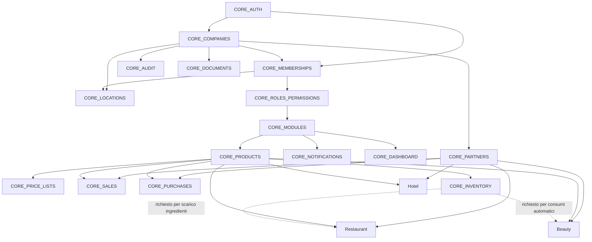
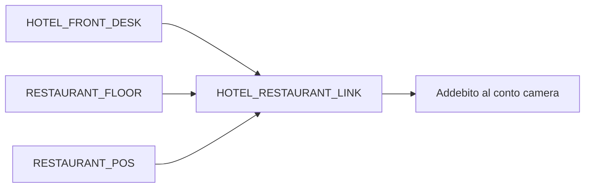
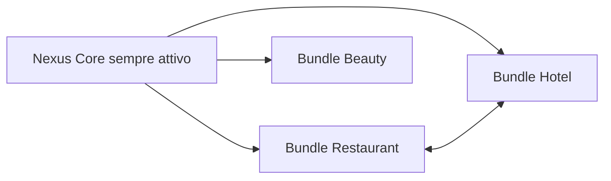
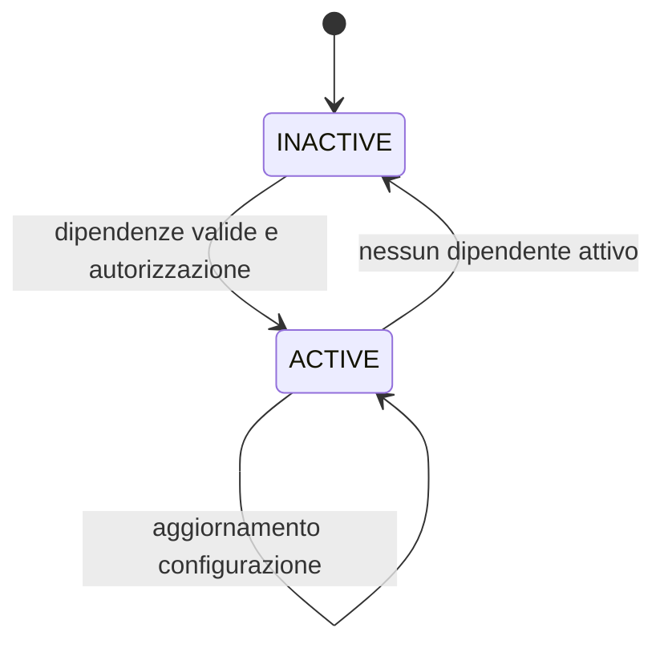

# Dipendenze fra moduli

## Regole invarianti

1. `CORE_AUTH`, `CORE_COMPANIES`, `CORE_MEMBERSHIPS`, `CORE_LOCATIONS`, `CORE_ROLES_PERMISSIONS`, `CORE_MODULES`, `CORE_PARTNERS`, `CORE_DOCUMENTS`, `CORE_AUDIT`, `CORE_NOTIFICATIONS` e `CORE_DASHBOARD` sono sempre attivi.
2. Partner è richiesto da vendite, acquisti, CRM, Hotel e Beauty.
3. Prodotti e servizi sono richiesti da vendite, acquisti, magazzino, Restaurant e Beauty.
4. Il magazzino è opzionale in generale, ma obbligatorio per ricette con scarico ingredienti e consumi Beauty automatici.
5. `HOTEL_RESTAURANT_LINK` dipende dal Front Desk e dai moduli Restaurant effettivamente scelti dalla Company.
6. Una dipendenza deve essere attiva prima del modulo dipendente; la disattivazione è rifiutata finché esistono moduli attivi dipendenti.
7. Disattivare un modulo non cancella, anonimizza o modifica i suoi dati.
8. I bundle Restaurant, Beauty e Hotel possono convivere nella stessa Company; l'attivazione di un bundle applica i suoi default e risolve le dipendenze senza duplicare il Core.
9. Il catalogo unico richiede `CORE_PRODUCTS`; la visibilità e le mutazioni dei tipi verticali richiedono anche il modulo proprietario: `RECIPE`/`INGREDIENT` usano `RESTAURANT_RECIPES`, `BEAUTY_SERVICE` usa `BEAUTY_APPOINTMENTS`, `HOTEL_ROOM` usa `HOTEL_ROOMS`, `PACKAGE` usa `BEAUTY_PACKAGES`. `GIFT_CARD` resta visibile solo con uno dei moduli loyalty pianificati.

## Grafo principale

Le frecce indicano “è prerequisito di”. I nodi aggregati rappresentano le dipendenze comuni del verticale; il dettaglio definitivo è nel [catalogo](MODULE_CATALOG.md).

## Collegamento Hotel–Restaurant

Il collegamento traduce un conto Restaurant in un addebito Hotel attraverso un contratto applicativo. Non autorizza accessi diretti alle tabelle di un altro verticale.

## Matrice di dipendenza

| Famiglia | Dipendenze minime | Dipendenze condizionali |
| --- | --- | --- |
| Sales Engine | Partner, Prodotti/Servizi, Unified Document Engine | Inventory per posting DDT stock-managed; Pagamenti per incasso futuro |
| Acquisti | Partner, Prodotti/Servizi | Documenti, Pagamenti, Magazzino |
| Inventory Engine | Prodotti/Servizi | Sales, Purchases e verticali invocano il servizio o consumano l'outbox; nessuno scrive direttamente `StockBalance` |
| CRM | Partner, Notifiche | Integrazioni |
| Restaurant | Partner, Prodotti/Servizi | Magazzino per ricette con scarico; Pagamenti/Integrazioni per POS |
| Hotel | Partner, Prodotti/Servizi | Documenti/Pagamenti per Front Desk; Restaurant per addebito camera |
| Beauty | Partner, Prodotti/Servizi | Magazzino per consumo; Pagamenti per pacchetti; Notifiche per promemoria |

Il controllo sul tipo Item è aggiuntivo rispetto al gate `/items` su `CORE_PRODUCTS`: nascondere un tipo nel form non sostituisce la verifica nelle query e nelle Server Actions.

## Default dei bundle

La doppia freccia rappresenta la convivenza possibile, non una dipendenza. I default completi e i codici stabili sono definiti nel [catalogo](MODULE_CATALOG.md#bundle-commerciali-e-configurazioni-predefinite).

## Semantica di attivazione

L'attivazione è per Company, atomica e auditata:

Un modulo disattivato:

- non appare nella sidebar o nella ricerca globale;
- non è accessibile tramite route, inclusi URL diretti;
- non espone Server Actions utilizzabili;
- non esegue job, webhook o automazioni;
- non concede né rende assegnabili i propri permessi;
- non appare nei report ordinari, salvo report amministrativi espliciti sui dati storici;
- conserva integralmente dati, audit e riferimenti.

La sola feature flag non è un controllo di sicurezza. Ogni ingresso server deve verificare sessione, Membership attiva, Company, modulo e permesso.

## Disattivazione e conservazione

Prima della disattivazione il sistema deve sospendere nuove operazioni, terminare o annullare in modo controllato i job e mantenere consultabilità amministrativa dove richiesta da obblighi legali. La riattivazione riprende dagli stessi dati, previa eventuale migrazione compatibile. Retention e cancellazione seguono policy dedicate, mai l'interruttore del modulo.

Vedere [Architettura](ARCHITECTURE.md) e [ADR-006](DECISIONS.md#adr-006-dati-non-cancellati-quando-un-modulo-viene-disattivato).
